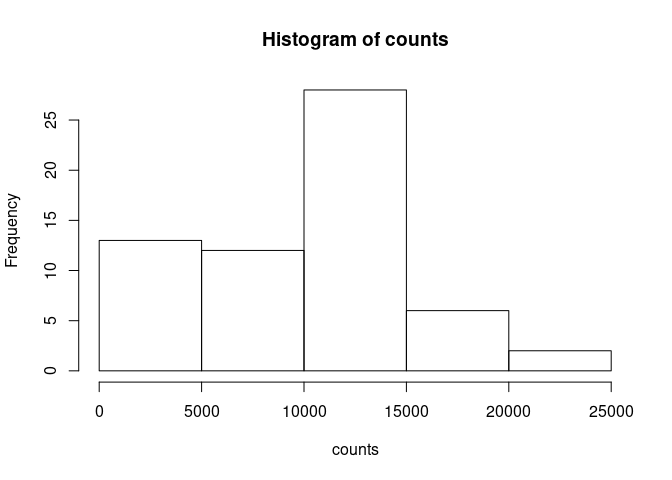
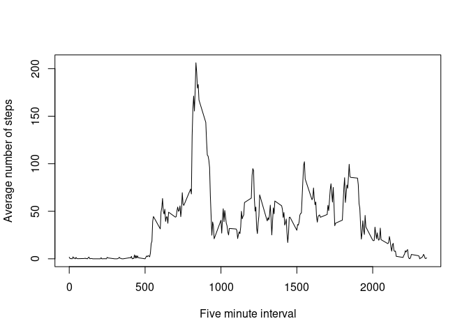
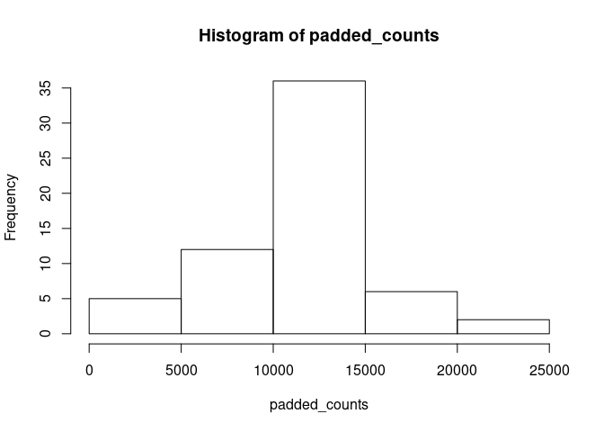
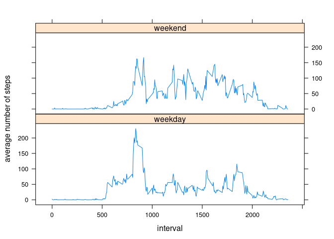

# Reproducible Research: Peer Assessment 1


## Loading and preprocessing the data


```r
library(data.table)
options(scipen=999)
data = fread('activity.csv')
summary(data)
```

```
##      steps            date              interval     
##  Min.   :  0.00   Length:17568       Min.   :   0.0  
##  1st Qu.:  0.00   Class :character   1st Qu.: 588.8  
##  Median :  0.00   Mode  :character   Median :1177.5  
##  Mean   : 37.38                      Mean   :1177.5  
##  3rd Qu.: 12.00                      3rd Qu.:1766.2  
##  Max.   :806.00                      Max.   :2355.0  
##  NA's   :2304
```


## What is mean total number of steps taken per day?


```r
days = split(data, factor(data$date))
counts = sapply(days, function (day) sum(day$steps, na.rm = TRUE))
hist(counts)
```

<!-- -->

The mean of the total number of steps take per day is 9354.23 and the median is 10395


## What is the average daily activity pattern?


```r
get_interval_means = function(days) {
  intervals = list()
  for (day in days) {
        for(i in 1:length(day$steps)) {
            interval = intervals[i][[1]]
            if (is.null(interval)) {
                interval = numeric()
            }
            intervals[[i]] = append(interval, day$steps[i])
        }
  }
  sapply(intervals, function(interval) mean(interval, na.rm = TRUE))
}

get_index_from_interval = function(interval) {
  (((interval %% 100) + (floor(interval / 100) * 60)) / 5) + 1
}

get_interval_from_index = function(index) {
  (floor(((index * 5) - 5) / 60) * 100) + (((index * 5) - 5) %% 60)
}

interval_means = get_interval_means(days)
plot(sapply(rep(1:288), get_interval_from_index), interval_means, 
     xlab='Five minute interval', ylab='Average number of steps', type='l')
```

<!-- -->

The interval with the largest average number of steps is 835 with 206.17 steps


## Imputing missing values

There are a total of 2304 NA values in this data set.

To remove these values i will use the average number of steps for all days on that interval in their place.


```r
padded_data = cbind(data)
for (i in 1:length(padded_data$steps)) {
    if(is.na(padded_data[i,]$steps)) {
        index = i %% 288
        if (index == 0) index = 288
        padded_data[i,]$steps = round(interval_means[index])
    }
}
summary(padded_data)
```

```
##      steps            date              interval     
##  Min.   :  0.00   Length:17568       Min.   :   0.0  
##  1st Qu.:  0.00   Class :character   1st Qu.: 588.8  
##  Median :  0.00   Mode  :character   Median :1177.5  
##  Mean   : 37.38                      Mean   :1177.5  
##  3rd Qu.: 27.00                      3rd Qu.:1766.2  
##  Max.   :806.00                      Max.   :2355.0
```


```r
padded_days = split(padded_data, factor(padded_data$date))
padded_counts = sapply(padded_days, function (day) sum(day$steps, na.rm = TRUE))
hist(padded_counts)
```

<!-- -->

The mean of the total number of steps take per day is 10765.64 and the median is 10762

By replacing NA values we the average for that time interval we have created a smother distribution of total step counts.

## Are there differences in activity patterns between weekdays and weekends?


```r
padded_data[, isweekend:=weekdays(suppressWarnings(strptime(date, '%Y-%m-%d')), abbreviate = FALSE) %in% c('Saturday', 'Sunday')]
weekdays = split(padded_data, factor(padded_data$isweekend, labels=c('weekday', 'weekend')))
weekend_interval_means = get_interval_means(split(weekdays$weekend, weekdays$weekend$date))
weekday_interval_means = get_interval_means(split(weekdays$weekday, weekdays$weekday$date))

all_intervals = append(weekday_interval_means, weekend_interval_means)
d = data.table(average_steps = all_intervals, interval = sapply(rep(1:288, 2), get_interval_from_index), 
               weekday = append(rep('weekday', 288), rep('weekend', 288)))

library(lattice)
xyplot(d$average_steps ~ d$interval | d$weekday, layout=c(1,2), type="l",
       xlab='interval', ylab='average number of steps')
```

<!-- -->
